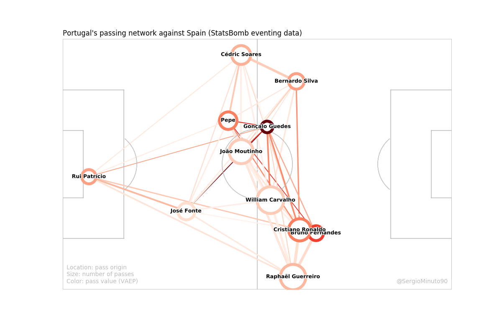

# passing-networks-in-python

Repository for building customizable passing networks with Matplotlib as part of the "Friends of Tracking" series. The code is prepared to use both eventing (StatsBomb) and tracking data (Metrica Sports).

The sample data can be found in the following repositories: 
* StatsBomb: https://github.com/statsbomb/open-data
* Metrica Sports: https://github.com/metrica-sports/sample-data

Also, further information about the VAEP metric can be found in this repository: https://github.com/ML-KULeuven/socceraction

Video tutorial: https://www.youtube.com/watch?v=JZ6Jc-cvKX8

### How to run this piece of software?

Please, follow these steps to be able to run the code:
1. Install the dependencies listed in _requirements.txt_
2. Download the sample data into the _data/eventing_ and _data/tracking_ folders.
3. (Optional) Run the _prepare_vaep.py_ script which trains a model with StatsBomb's data and computes and sets the VAEP metric for each action in the eventing dataset. It might take some minutes.

Now you are ready to go!

### How to customize the plots?

The script run.py allows you to choose the following arguments:
* -m (--match-id) specifies the match ID.
* -t (--team-name) is the name of the team that will be plotted from the previous match.
* -s (--source) must be either _eventing_ or _tracking_.
* -k (--plot-type) can be _basic_, _pass_value_, or _tracking_.

For eventing data, only _basic_ and _pass_value_ plot types are allowed. The basic one uses the number of passes as the metric for both the size and color of nodes and edges. On the other hand, _pass_value_ uses the number of passes for the size, whereas the color range depends on the value of the passes (computed with the VAEP metric).

For tracking data, only _basic_ and _tracking_ plot types are allowed. _basic_ will plot the nodes in the average locations where each player makes his passes. _tracking_ will plot the players in their average location. This second plot type can be customized with the following optional arguments:
* -b (--ball-location). If present, it filters the location of the player to those frames when the ball was in the team's half (_own_half_) or in the opponent's half of the pitch (_opponent_half_).
* -c (--context). If present, it filters the location of the player to those frames when the selected team was either _attacking_ or _defending_.

In addition, the colors and sizes of the elements in networks can be configured by changing the values in the _visualization/plot_config.json_ file.

### Examples of bash commands

StatsBomb: `python3 run.py -m 7576 -t Portugal -s eventing -k pass_value`

Metrica: `python3 run.py -m 1 -t Home -s tracking -k tracking -c attacking -b opponent_half`

The resulting images will be saved onto the _plots_ folder.

### Contact information

For further information, please contact me on Twitter: [@SergioMinuto90](https://twitter.com/SergioMinuto90).
